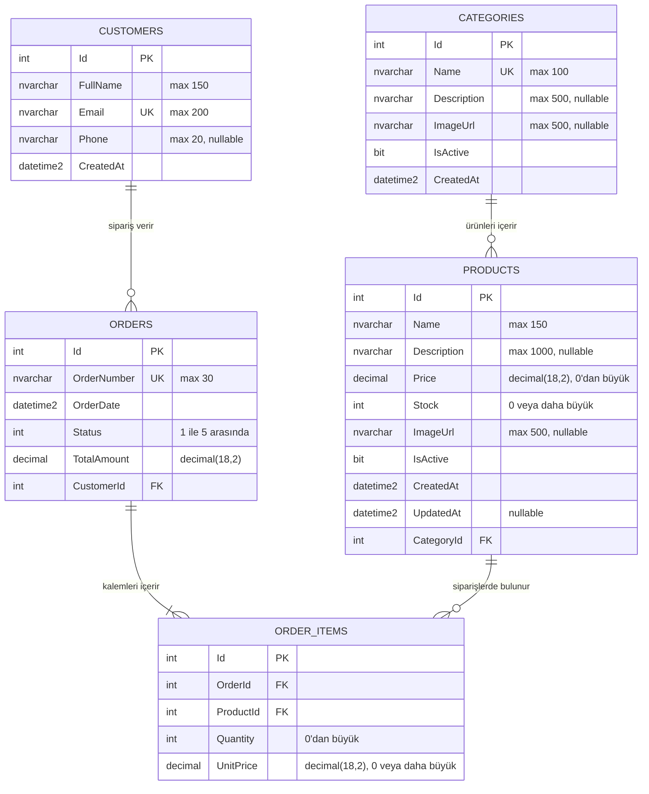

# MiniShop Database Diagram

## Relationships

- One category can contain zero or many products.
- Every product belongs to one category.
- One customer can place zero or many orders.
- Every order belongs to one customer.
- Every order contains at least one order item.
- Every order item belongs to one order.
- One product can appear in zero or many order items.
- Every order item refers to one product.

## Database Rules

### Unique Constraints

- `Categories.Name`
- `Customers.Email`
- `Orders.OrderNumber`
- `OrderItems(OrderId, ProductId)`

### Check Constraints

- `Products.Price > 0`
- `Products.Stock >= 0`
- `OrderItems.Quantity > 0`
- `OrderItems.UnitPrice >= 0`
- `Orders.Status BETWEEN 1 AND 5`

### Delete Behaviors

- Category to Products: `RESTRICT`
- Customer to Orders: `RESTRICT`
- Product to OrderItems: `RESTRICT`
- Order to OrderItems: `CASCADE`
